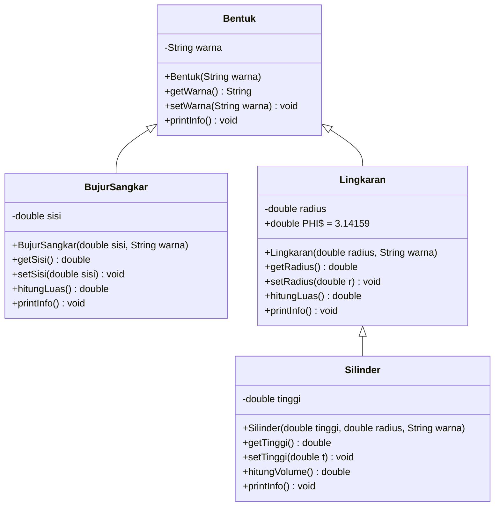

<h1 align="center">🔷 Inheritance dan Polimorfisme</h1>

<p align="center">
  
  
  
  
</p>

<p align="center">
  Implementasi konsep <b>pewarisan (inheritance)</b> pada Java melalui hierarki bentuk geometri:<br>
  dari <b>Bentuk</b> umum hingga <b>Silinder</b> yang menghitung volume.
</p>

---

## 📑 Daftar Isi

- [Tentang Proyek](#-tentang-proyek)
- [Hierarki Kelas](#-hierarki-kelas)
- [Konsep yang Dipelajari](#-konsep-yang-dipelajari)
- [Struktur Proyek](#-struktur-proyek)
- [Penjelasan Kelas](#-penjelasan-kelas)
- [Cara Menjalankan](#-cara-menjalankan)
- [Contoh Output](#-contoh-output)
- [Ide Pengembangan](#-ide-pengembangan)
- [Identitas Pembuat](#-identitas-pembuat)

---

## 📖 Tentang Proyek

Proyek ini dibuat untuk memahami bagaimana sebuah kelas dapat **mewarisi atribut dan method** dari kelas lain menggunakan kata kunci `extends`. Setiap kelas turunan menambahkan atribut dan perilaku miliknya sendiri, serta menyesuaikan method `printInfo()` melalui **method overriding**.

Rantai pewarisan yang digunakan:

> `Bentuk` → `Lingkaran` → `Silinder`
> `Bentuk` → `BujurSangkar`

## 🌳 Hierarki Kelas



## 🧠 Konsep yang Dipelajari

| Konsep | Penerapan dalam Proyek |
|---|---|
| **Inheritance (`extends`)** | `BujurSangkar` dan `Lingkaran` mewarisi `Bentuk`; `Silinder` mewarisi `Lingkaran` |
| **Multilevel Inheritance** | Tiga tingkat pewarisan: `Bentuk` → `Lingkaran` → `Silinder` |
| **`super()` Constructor** | Kelas turunan meneruskan `warna` / `radius` ke constructor induk |
| **Method Overriding (`@Override`)** | `printInfo()` ditulis ulang di setiap kelas turunan |
| **Encapsulation** | Semua atribut `private`, diakses lewat *getter* dan *setter* |
| **Konstanta (`static final`)** | `PHI` pada `Lingkaran` sebagai nilai tetap |
| **Reuse Kode** | `Silinder` memakai `hitungLuas()` milik `Lingkaran` untuk menghitung volume |

## 📂 Struktur Proyek

```
📦 inheritance-bentuk-java
 ┣ 📜 Bentuk.java          # Kelas induk (superclass)
 ┣ 📜 BujurSangkar.java    # Turunan Bentuk
 ┣ 📜 Lingkaran.java       # Turunan Bentuk
 ┣ 📜 Silinder.java        # Turunan Lingkaran
 ┣ 📜 Main.java            # Kelas utama (main)
 ┗ 📜 README.md
```

## 🔍 Penjelasan Kelas

### 🟣 `Bentuk` (Superclass)
Kelas dasar yang menyimpan atribut `warna`.

| Method | Deskripsi |
|---|---|
| `getWarna()` / `setWarna()` | Mengambil dan mengubah warna |
| `printInfo()` | Mencetak `Bentuk berwarna <warna>` |

### 🟦 `BujurSangkar` extends `Bentuk`
Menambahkan atribut `sisi`.

| Method | Deskripsi |
|---|---|
| `hitungLuas()` | Menghitung luas: `sisi × sisi` |
| `printInfo()` | *Override*: mencetak warna dan luas |

### 🟠 `Lingkaran` extends `Bentuk`
Menambahkan atribut `radius` dan konstanta `PHI = 3.14159`.

| Method | Deskripsi |
|---|---|
| `hitungLuas()` | Menghitung luas: `PHI × radius × radius` |
| `printInfo()` | *Override*: mencetak warna dan luas |

### 🟢 `Silinder` extends `Lingkaran`
Menambahkan atribut `tinggi`. Alas silinder adalah lingkaran, sehingga luas alas diambil dari method milik induk.

| Method | Deskripsi |
|---|---|
| `hitungVolume()` | Menghitung volume: `hitungLuas() × tinggi` |
| `printInfo()` | *Override*: mencetak warna dan volume |

### ▶️ `Main`
Membuat satu objek dari tiap kelas lalu memanggil `printInfo()`. Setiap objek merespons dengan caranya sendiri, ini adalah contoh **polimorfisme** sederhana.

## 🚀 Cara Menjalankan

### Prasyarat
- **JDK 8** atau lebih baru ([Download JDK](https://adoptium.net/))

```bash
java -version
javac -version
```

### Langkah-langkah

1. **Clone repositori**

   ```bash
   git clone https://github.com/<username>/<nama-repositori>.git
   cd <nama-repositori>
   ```

2. **Kompilasi seluruh file**

   ```bash
   javac *.java
   ```

3. **Jalankan program**

   ```bash
   java Main
   ```

## 🖥️ Contoh Output

```text
Bentuk berwarna Merah
Bujur sangkar berwarna Biru, luas = 25.0
Lingkaran Merah, luas = 153.93791
Silinder warna Merah, volume = 1539.3790999999999
```

**Data uji dan perhitungannya:**

| Objek | Parameter | Rumus | Hasil |
|---|---|---|---:|
| `Bentuk` | warna = Merah | - | - |
| `BujurSangkar` | sisi = 5.0, warna = Biru | 5 × 5 | **25.0** |
| `Lingkaran` | radius = 7.0, warna = Merah | 3.14159 × 7 × 7 | **153.93791** |
| `Silinder` | tinggi = 10.0, radius = 7.0 | 153.93791 × 10 | **≈ 1539.379** |

> 💡 **Catatan:** Volume silinder tampil sebagai `1539.3790999999999` (bukan `1539.3791`) karena sifat bilangan desimal bertipe `double` yang tidak selalu presisi sempurna. Untuk tampilan lebih rapi, gunakan `System.out.printf("%.2f", nilai)`.

## 💡 Ide Pengembangan

- [ ] Menambahkan bentuk lain seperti `Persegi Panjang`, `Segitiga`, atau `Kerucut`
- [ ] Menambahkan method `hitungKeliling()` pada bentuk 2D
- [ ] Menggunakan `Math.PI` sebagai pengganti konstanta `PHI` manual
- [ ] Menjadikan `Bentuk` sebagai **abstract class** dengan method abstrak `hitungLuas()`
- [ ] Memformat output menggunakan `printf` agar angka lebih rapi
- [ ] Menyimpan banyak bentuk dalam satu `ArrayList<Bentuk>` untuk mendemonstrasikan polimorfisme

---

## 🎓 Identitas Pembuat

<table align="center">
  <tr>
    <td align="center"><b>Nama</b></td>
    <td>Iqbal Mauluddin</td>
  </tr>
  <tr>
    <td align="center"><b>NIM</b></td>
    <td>F1D02510011</td>
  </tr>
  <tr>
    <td align="center"><b>Kelas</b></td>
    <td>B</td>
  </tr>
  <tr>
    <td align="center"><b>Mata Kuliah</b></td>
    <td>Pemrograman Berorientasi Objek (PBO)</td>
  </tr>
  <tr>
    <td align="center"><b>GitHub</b></td>
    <td><a href="https://github.com/iqbalmauluddin2903-eng">@iqbalmauluddin2903-eng</a></td>
  </tr>
</table>

<p align="center">⭐ Jika proyek ini bermanfaat, jangan lupa beri bintang pada repositori ini! ⭐</p>
